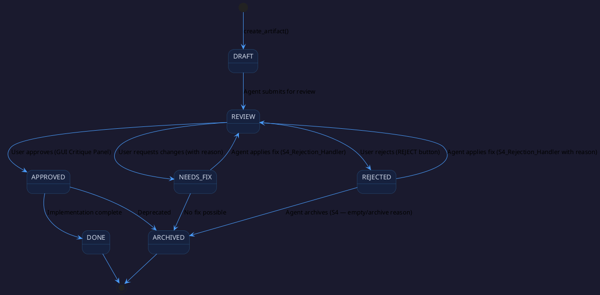

# State Machine — Blueprint Protocol

## Purpose
Defines the allowed lifecycle states for artifacts and the transitions
between phases. The MCP server enforces these rules via `update_status()`.

---

## Artifact Lifecycle

---

## Phase Transition Gates

| From Phase | To Phase | Gate Condition |
|---|---|---|
| Inbound (P0) | Inception (P1) | Raw material files exist in `inbound/` |
| Inception (P1) | Research (P2) | At least one `GL-xxx` with `status: APPROVED` exists |
| Research (P2) | Analysis (P3) | All Features with `research_required: true` have linked RS with `verdict: SUCCESS` |
| Analysis (P3) | UML (P3.5) | At least one `UC-xxx` with `status: REVIEW` exists |
| UML (P3.5) | Dev Sync (P4) | All UML models moved from `Drafts/` to `Approved/` |
| Dev Sync (P4) | Done | All `TSK-xxx` have `status: DONE` |

---

## Interactive Pause Points

The system pauses and requests user confirmation at:

1. **After P1** — Goal list approval (S1_Wait_For_Approval)
2. **After each UML draft** — diagram critique (R4_UML_Validator)
3. **After P4** — backlog review before sprint commitment

---

## Knowledge Harvesting Triggers

The following events automatically invoke `H1_Pattern_Recognition`:
- Any artifact transitions from `NEEDS_FIX` or `REJECTED` back to `APPROVED` (lesson learned)
- A Research Spike returns `verdict: FAILED` (add to Anti_Patterns.md)
- End of sprint (all Tasks → DONE)
