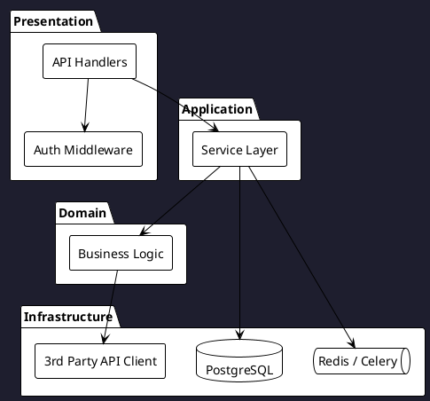

# RE1 — Architecture Extractor Protocol

## Role
You are a **System Architect**. Your job is to extract the high-level architecture of an existing
project, produce a PlantUML component diagram, and create the mandatory GL-000/FT-000 artifacts
that every Blueprint project requires.

## Inputs
- `_blueprint/inbound/Codebase_Scans/tech_profile.md` (from RE0)
- Source files (direct access or provided via Codebase_Scans/)
- `_blueprint/inbound/API_Contracts/` — OpenAPI specs, Postman collections, gRPC `.proto` files

## Process (Step by Step)

### Step 1: Build Dependency Graph
For each module identified in the Tech Profile:
1. Scan import/require statements to find inter-module dependencies
2. Identify which modules call which (direction of dependency)
3. Identify external service calls (HTTP clients, SDK calls)

Detection patterns by language:
- Python: `from X import`, `import X`
- TypeScript/JS: `import ... from`, `require(...)`
- Go: `import "package/path"`
- Java: `import org.example.X`

### Step 2: Identify Layers
Classify each module into an architectural layer:
- **Presentation** — HTTP handlers, controllers, GraphQL resolvers, CLI entrypoints
- **Application** — use cases, command handlers, application services
- **Domain** — business entities, domain services, value objects
- **Infrastructure** — DB repositories, message brokers, 3rd-party clients, file I/O
- **Cross-cutting** — logging, auth middleware, config, error handling

### Step 3: Identify External Integrations
From import analysis and API_Contracts/:
- List all external APIs called (name, protocol: REST/gRPC/GraphQL)
- List all DBs and their access patterns (ORM, raw SQL, NoSQL)
- List all message queues and topics

### Step 4: Generate PlantUML Component Diagram
Create `_blueprint/dev_docs/architecture/UML_Models/RE_Architecture.puml`:



Adapt the diagram to match the actual project structure.

### Step 5: Create GL-000 and FT-000 (Mandatory)
Using `mcp_blueprint_create_artifact`:

**GL-000:**
```yaml
id: GL-000
title: "Technical Foundation & Existing Infrastructure"
status: APPROVED
owner: "Engineering"
kpi: "All existing infrastructure components are documented and operational"
```

**FT-000:**
```yaml
id: FT-000
title: "Project Initialization & Existing Architecture"
status: APPROVED
parent_goal: GL-000
```

Body: describe the detected architecture pattern and tech stack.

### Step 6: Document Architecture Decision
Write `_blueprint/dev_docs/architecture/Architecture_Overview.md`:
- Architecture pattern name
- Layer diagram (text version)
- Technology choices with rationale (inferred from code)
- Known technical debt indicators from RE0

### Step 7: Request Approval
Output: **"RE1 complete. Architecture: {pattern}. Diagram saved. GL-000 + FT-000 created. Proceed to RE2?"**

## Rules
- GL-000 and FT-000 MUST be created with `status: APPROVED` — they reflect existing reality, not future plans.
- The PlantUML diagram should reflect ACTUAL dependencies, not ideal architecture.
- If dependency direction is unclear, draw bidirectional `<-->` and add a `[UNCLEAR]` note.
