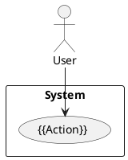

# UML Draft: {{DIAGRAM TITLE}}

## Diagram

## Review Notes
<!-- Human: add critique here. Agent: read this section in R4_UML_Validator protocol -->

## Validation Checklist (R4)
- [ ] All actors are defined in parent UseCase `actors` field
- [ ] All failure paths from `Failure Points` are represented
- [ ] No logical dead-ends (states with no exit)
- [ ] Sequence diagram shows return messages (not just calls)
