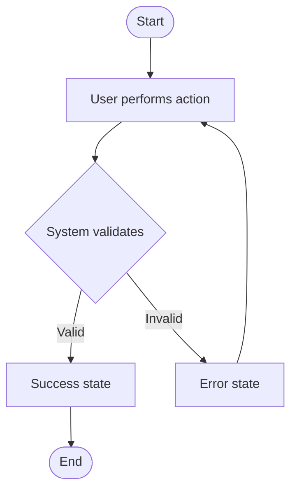

# Use Case: {{SCENARIO TITLE}}

## Preconditions
{{What must be true before this scenario starts? (e.g., User is logged in, item exists in cart)}}

## Main Flow (Happy Path)
1. User {{action}}.
2. System {{response}}.
3. System validates {{condition}}.
4. System returns {{result}}.

## Alternative Flows
- **[ALT-1] {{Condition}}:** {{What happens instead.}}
- **[ALT-2] {{Condition}}:** {{What happens instead.}}

## Failure Points (→ Fuzzing)
<!-- Agent: each failure point becomes a Fuzzing Vector in TSK artifacts -->
- **[F-1]** {{What can go wrong here? e.g., Invalid input format}}
- **[F-2]** {{Another potential failure}}

## User Flow (Mermaid)

## System States
- **Before:** `{{state_before}}`
- **After success:** `{{state_after_success}}`
- **After failure:** `["{{state_after_failure}}"]`

## Linked Tasks
<!-- Agent: populate after P4_Dev_Sync generates TSK artifacts -->
- [ ] [TSK-xxx](../../execution/backlog/TSK-xxx.md) — Backend implementation
- [ ] [TSK-xxx](../../execution/backlog/TSK-xxx.md) — Frontend implementation
## Critique History
