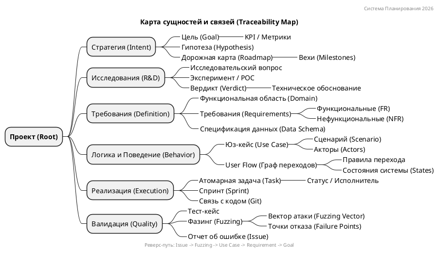
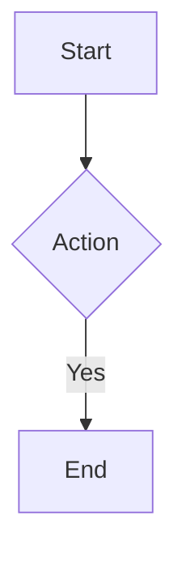

Я бы хотел обсудить существующие системы для разработки дизайна приложений и планирования преложения

Разработка приложения — это процесс, который делится на несколько ключевых этапов: от формирования идеи и карты путей пользователя до создания высокодетализированных макетов и управления задачами.

Вот обзор актуальных систем на 2026 год, разделенный по категориям использования:

---

## 1. Проектирование и UI/UX дизайн

Это инструменты для визуализации интерфейса и создания интерактивных прототипов.

* **Figma** — абсолютный лидер. В 2026 году она еще сильнее интегрировала ИИ-функции (**Figma AI**) для генерации первичных макетов по текстовому описанию и автоматизации рутины (переименование слоев, замена контента).
* **UX Pilot AI** — специализированный инструмент для генерации целых дизайн-систем и логики интерфейса на основе текстовых промптов с последующим экспортом в ту же Figma.
* **Framer** — если вам нужно превратить дизайн сразу в работающий фронтенд. Он позволяет создавать анимации и переходы, которые технически идентичны реальному коду.
* **Balsamiq** — идеален для этапа «черновиков» (wireframes). Позволяет сфокусироваться на логике и расположении кнопок, не отвлекаясь на цвета и шрифты.

---

## 2. Планирование и архитектура (Whiteboarding)

Прежде чем рисовать кнопки, нужно понять, как пользователь будет перемещаться по приложению.

* **Miro / FigJam** — бесконечные онлайн-доски. Лучше всего подходят для:
* Создания **User Flow** (путь пользователя).
* **Mind Maps** (карты идей).
* Проектирования структуры базы данных (ER-диаграммы).


* **FlowMapp** — узкоспециализированный инструмент для создания карт сайтов (Sitemaps) и планирования структуры страниц.

---

## 3. Управление разработкой и задачами

Когда дизайн готов, его нужно декомпозировать на задачи для программистов.

| Система | Для кого лучше всего | Особенности в 2026 году |
| --- | --- | --- |
| **Jira / Kaiten** | Для крупных команд | Глубокая интеграция с кодом (GitLab/GitHub) и поддержка Agile/Scrum. |
| **Notion** | Для небольших проектов | Универсальное пространство: здесь и ТЗ, и документация, и простые канбан-доски. |
| **Linear** | Для быстрых стартапов | Минималистичный интерфейс, высокая скорость работы и фокус на «потоке» разработки. |
| **YouGile** | Для прозрачной коммуникации | Российская система, где каждая задача — это отдельный чат (гибрид Trello и Telegram). |

---

## 4. Новое в 2026: AI-ассистенты планирования

Сейчас активно развиваются инструменты типа **Lovable** или **v0.dev**. Они позволяют «надиктовать» идею приложения, и система сама предлагает структуру проекта, подбирает стек технологий и генерирует первые экраны.

> **Совет:** Если вы только начинаете проект, лучше всего начать связку **Miro** (логика) + **Figma** (визуализация) + **Notion** (документация и задачи).

Хотите, чтобы я помог составить примерный план реализации (Roadmap) для конкретно вашего приложения? Например, мы можем рассмотреть структуру базы данных или основные этапы разработки.

У меня идея обеденить генерацию документацыи из требований фючерсов гоалс юс кейсов тасктрекинг робмапинг фазинг в любых направлениях для создания цельной документацыи по планированию проекта также юзер флоу

Идея создания единой экосистемы, где требования (Features/Goals) автоматически превращаются в документацию, задачи и визуальные схемы (User Flow), — это «святой грааль» системного анализа. Сейчас эти процессы часто разорваны: ТЗ живет в Notion, задачи в Jira, а схемы в Miro, и при изменении одного всё остальное моментально устаревает.

Для реализации такой системы «все в одном» стоит рассмотреть следующие архитектурные уровни:

### 1. Ядро: Единый источник истины (SSOT)

Вместо того чтобы хранить данные в разных форматах, используется графовая структура.

* **Связи:** Каждая «Цель» (Goal) связана с «Фичами» (Features), которые в свою очередь порождают «Юз-кейсы» (Use Cases).
* **Автогенерация:** Если вы меняете описание фичи, система должна автоматически предлагать обновить связанные с ней задачи в таск-трекере и шаги в User Flow.

### 2. Визуализация и User Flow (Проектирование)

Чтобы объединить текст и схемы, можно использовать подход **Diagrams as Code** (например, Mermaid или PlantUML).

* В вашей системе пользователь пишет текстовый сценарий использования, а нейросеть или парсер на лету отрисовывает User Flow.
* Это позволяет избежать ручного рисования стрелочек в Figma или Miro, которые постоянно нужно переделывать при изменении логики.

### 3. Таск-трекинг и Роадмапинг

Интеграция планирования должна быть двусторонней:

* **Top-down:** Из стратегии (Roadmap) нарезаются задачи.
* **Bottom-up:** Статус выполнения задач автоматически двигает прогресс-бары в документации и на дорожной карте.

### 4. Фазинг и тестирование (Валидация)

Добавление фазинга (тестирования на случайных входных данных) прямо в планирование — это мощный ход.

* Система может анализировать ваши требования и автоматически генерировать негативные сценарии (Edge Cases).
* На основе юз-кейсов можно автоматически создавать спецификации для инструментов фазинг-тестирования, проверяя устойчивость логики еще до написания основного кода.

---

### Как это могло бы выглядеть для вас:

Если вы планируете разрабатывать такой инструмент (например, на **Python/FastAPI** со **Svelte** на фронтенде, как в ваших интересах), ключевым стеком могли бы стать:

1. **LLM (OpenAI API / Anthropic):** Для трансформации сырых требований в структурированные JSON-объекты.
2. **ArangoDB или Neo4j:** Графовые базы данных идеально подходят для хранения связей между целями, задачами и документацией.
3. **Canvas API / WebGL:** Для динамического отображения User Flow и интерактивных карт проекта.

**С чего бы вы хотели начать обсуждение реализации?** Мы можем детализировать:

* Структуру связей между документацией и задачами.
* Как именно фазинг может встраиваться в процесс планирования.
* Механику генерации визуальных User Flow из текста.

Нужно определится чем я буду оперировать и как, мне нужны артефакты какие какие сущности присутствуют в системе

Для создания системы, которая объединяет планирование, документацию и тестирование, нам нужно выстроить четкую иерархию сущностей. Главная фишка вашей идеи — **прослеживаемость (traceability)**: когда изменение в «Цели» автоматически подсвечивает изменения в «Задачах» и «Тестах».

Вот архитектурный набор артефактов и сущностей, которыми будет оперировать система:

---

## 1. Уровень Стратегии (High-Level)

Здесь определяются глобальные смыслы проекта.

* **Миссия/Цель (Goal):** Описание того, какую проблему решает проект.
* *Свойства:* Приоритет, измеримый KPI, статус достижения.


* **Дорожная карта (Roadmap):** Временная шкала, на которую нанизаны ключевые этапы (Milestones).
* *Связи:* Объединяет несколько фич в один релизный цикл.


---

## 2. Уровень Требований (Requirements)

Трансформация идей в конкретные функциональные блоки.

* **Фича (Feature):** Крупный функциональный блок (например, «Авторизация» или «Генератор PDF»).
* **Пользовательская история (User Story):** Описание ценности для пользователя в формате: *«Как [роль], я хочу [действие], чтобы [профит]»*.
* **Требование (Requirement):** Атомарное правило (функциональное или нефункциональное).
* *Свойства:* Версионность, критичность.


---

## 3. Уровень Логики и Процессов (Behavior)

Визуализация того, как всё будет работать.

* **Юз-кейс (Use Case):** Детальный сценарий взаимодействия пользователя с системой (основной поток и альтернативные ветки).
* **User Flow (Схема потока):** Графическое представление переходов между состояниями или экранами.
* *Свойства:* Узлы (экраны/действия) и ребра (переходы/условия).


* **Акторы (Actors):** Роли пользователей или внешние системы, взаимодействующие с приложением.

---

## 4. Уровень Исполнения (Execution)

То, что уходит в работу разработчикам.

* **Задача (Task/Ticket):** Атомарная единица работы.
* *Связи:* Каждая задача **обязательно** ссылается на User Story или Requirement.


* **Спринт (Sprint):** Временной отрезок, в который группируются задачи.

---

## 5. Уровень Валидации и Фазинга (Quality & Robustness)

Ваш уникальный слой, который проверяет систему на прочность.

* **Тест-кейс (Test Case):** Ожидаемое поведение (позитивный сценарий).
* **Модель фазинга (Fuzzing Model):** Описание структуры входных данных для «простукивания» системы (граничные значения, случайные строки, некорректные типы).
* **Отчет об уязвимости/баге (Issue):** Результат работы фазера или ручного тестирования.

---

## Матрица связей (Traceability Matrix)

Чтобы система была цельной, сущности должны быть связаны следующим образом:

| Сущность | Порождает | Влияет на | Проверяется |
| --- | --- | --- | --- |
| **Goal** | Features | Roadmap | — |
| **Feature** | User Stories | User Flow | — |
| **User Story** | Tasks | UI Design | Test Cases |
| **Use Case** | User Flow | — | **Fuzzing Model** |
| **Task** | Code | Sprint | Unit Tests |

---

### Как это работает в динамике:

1. Вы меняете **Use Case** (например, добавляете поле «Возраст» в регистрацию).
2. Система подсвечивает **User Flow** (нужно добавить новый узел).
3. Система генерирует новую **Task** для фронтенда и бэкенда.
4. Модель **Фазинга** автоматически обновляется, чтобы начать присылать в поле «Возраст» отрицательные числа или эмодзи для проверки валидации.

**С какой из этих категорий (Стратегия, Логика или Фазинг) мы начнем детально прорабатывать структуру базы данных?** Можем набросать схему таблиц или JSON-структуру для хранения связей.

Какие сущности полезны для декомпозиции, на базе етого нужно генерировать документы и иметь реверс путь

Для того чтобы система позволяла не только генерировать документацию «сверху вниз», но и отслеживать «реверс-путь» (от задачи или бага обратно к бизнес-цели), сущности должны быть максимально атомарными и связанными через **уникальные ID** и **типы отношений**.

Вот оптимальный набор сущностей для глубокой декомпозиции с поддержкой реверс-инжиниринга логики:

### 1. Уровень Намерения (Intent Layer)

Это «зачем» мы это делаем.

* **Бизнес-цель (Goal):** Высокоуровневый желаемый результат (например, «Увеличить конверсию в регистрацию на 20%»).
* **Гипотеза (Hypothesis):** Предположение, которое мы проверяем. Если гипотеза не подтвердилась, все дочерние артефакты можно помечать как «архивные».

### 2. Уровень Определения (Definition Layer)

Это «что» мы делаем.

* **Функциональная область (Domain/Module):** Граница системы (например, «Биллинг», «Профиль»). Помогает в реверс-пути понять, какой модуль пострадает при изменении требования.
* **Требование (Requirement):** Конкретное условие. Важно делить на:
* *Функциональные (FR):* Что система делает.
* *Нефункциональные (NFR):* Производительность, безопасность, требования к фазингу.


* **Спецификация данных (Data Schema):** Описание структур, которыми оперирует фича. Это критично для генерации документации API.

### 3. Уровень Поведения (Behavioral Layer)

Это «как» это работает. Здесь рождается User Flow.

* **Сценарий (Scenario/Use Case Step):** Атомарный шаг взаимодействия.
* *Пример:* «Пользователь нажимает кнопку Х».


* **Правило перехода (Transition Rule):** Условие, при котором пользователь переходит от шага А к шагу Б. Именно из этих правил строится граф **User Flow**.
* **Точка отказа (Failure Point):** Описание того, где система может сломаться. Эта сущность — мост к **Фазингу**.

### 4. Уровень Реализации и Проверки (Execution & Validation)

Это «чем» мы проверяем и как внедряем.

* **Атомарная задача (Task):** Техническое задание для разработчика.
* **Входной вектор фазинга (Fuzzing Vector):** Описание типов данных и их границ для автоматической проверки сценария на прочность.
* **Проверка (Assertion):** Ожидаемый результат, который должен быть зафиксирован в документации как «эталон».

---

### Как работает «Реверс-путь» (Traceability)

Чтобы обеспечить обратную связь, каждая сущность должна содержать **Dependency Map** (карту зависимостей).

**Пример цепочки в вашей системе:**

1. **Ошибка в логах/Баг:** Обнаружен фазером при вводе спецсимволов.
2. **Реверс к Тесту:** Видим, какой `Fuzzing Vector` вызвал ошибку.
3. **Реверс к Сценарию:** Тест был привязан к `Scenario: Регистрация`.
4. **Реверс к Требованию:** Сценарий реализует `Requirement: Валидация имени`.
5. **Реверс к Цели:** Это требование было создано для `Goal: Чистота данных в БД`.

### Артефакты, которые генерируются на базе этих сущностей:

1. **PRD (Product Requirements Document):** Автосборка из *Goals + Requirements + Data Schemas*.
2. **Интерактивный User Flow:** Граф, построенный из *Scenarios* и *Transition Rules* (например, через Mermaid.js).
3. **Fuzzing Strategy:** Документ для QA, описывающий, какие *Failure Points* покрыты тестами.
4. **Auto-Changelog:** При изменении любой сущности система генерирует текст: «Изменение в Цели Х привело к обновлению Требований Y и Z, что затронуло 3 задачи в трекере».

**Как вы смотрите на то, чтобы добавить сущность «Состояние системы» (State)?** Это позволит генерировать документацию не только по действиям пользователя, но и по внутренним изменениям в базе данных или API на каждом этапе пути.

Ок

Раз мы определились с основными сущностями и важностью «реверс-пути», давайте перейдем к конкретике. Чтобы система работала как единое целое, нам нужно внедрить концепцию **«Графа Проекта»**.

В обычном таск-трекере задачи — это просто список. В вашей системе — это **узлы (nodes)**, соединенные **связями (edges)**.

### Как реализовать «Реверс-путь» на уровне данных?

Для каждой сущности я предлагаю внедрить обязательный блок метаданных **`Origins`** и **`Impact`**:

* **Origins (Откуда пришло):** Ссылка на родительскую сущность (например, Задача ссылается на Юз-кейс, Юз-кейс — на Фичу).
* **Impact (На что влияет):** Список дочерних или зависимых сущностей (например, изменение в API-схеме «подсвечивает» красным связанные тесты фазинга и документацию фронтенда).

---

### Практический пример цепочки (Data Flow)

Представьте, что вы создаете модуль «Оплата»:

1. **Goal (Цель):** Принимать платежи через Stripe.
2. **Feature (Фича):** Подписка на сервис.
3. **Requirement (Требование):** Валидация номера карты (NFR: Безопасность).
4. **Use Case (Сценарий):** «Пользователь вводит данные -> Система проверяет -> Ошибка/Успех».
5. **User Flow (Схема):** Визуальный переход между экраном ввода и экраном «Спасибо».
6. **Fuzzing Vector (Фазинг):** Генерация строк с буквами вместо цифр, проверка на SQL-инъекции в поле ввода.
7. **Task (Задача):** Написать функцию `validateCard()`.

**Реверс-путь в действии:**
Если фазинг нашел баг (например, система падает при вводе 100 символов в поле карты), система мгновенно показывает:

* Какая **Задача** это реализовала.
* Какой **Сценарий** нарушен.
* Какое **Требование** не соблюдено.
* Какая **Бизнес-цель** под угрозой (платежи не пройдут).

---

### Следующий шаг: Технический стек

Учитывая ваш интерес к **Python (FastAPI)** и **Svelte**, мы можем спроектировать ядро системы.

**Что обсудим первым?**

1. **Архитектуру БД:** Как хранить этот граф (SQL с JSONB или графовая БД типа Neo4j/ArangoDB)?
2. **Механику Фазинга:** Как именно из требований генерировать векторы атак или некорректных данных?
3. **Автогенерацию документации:** Использование Markdown или специальных схем (Mermaid/PlantUML) для отрисовки User Flow.

Выбирайте направление, и мы «набросаем» структуру!

Как включить в систему ресарч и девелоп что нужно изучить ценность внедрения

Интеграция **Research & Development (R&D)** в вашу систему — это критически важный этап, который превращает «инструмент для записи идей» в «двигатель инноваций». В вашей архитектуре R&D будет выступать как фильтр между **Целью (Goal)** и **Фичей (Feature)**.

---

## 1. Сущности для R&D блока

Чтобы ресерч не терялся в заметках, его нужно превратить в артефакты:

* **Исследовательский вопрос (Research Question):** Конкретная неопределенность (например, «Можно ли использовать WebAssembly для обработки видео на клиенте?»).
* **Гипотеза (Hypothesis):** Предполагаемый ответ, который нужно подтвердить или опровергнуть.
* **Эксперимент / POC (Proof of Concept):** Быстрая реализация части функционала для проверки гипотезы.
* **Вердикт (Verdict):** Итог исследования (Принято / Отклонено / Требует доработки).

---

## 2. Что нужно изучить (Research Stack)

Для создания такой глубоко интегрированной системы вам понадобятся знания в следующих областях:

### Системное проектирование и Графы

* **Graph Databases (Neo4j / ArangoDB):** Поскольку всё связано со всем (реверс-путь), реляционные таблицы (SQL) могут стать слишком сложными. Изучите, как строить связи между узлами.
* **Ontology Engineering:** Как правильно классифицировать знания, чтобы ИИ понимал контекст вашего проекта.

### Автоматизация и Фазинг

* **Property-Based Testing (библиотека Hypothesis для Python):** Это база для вашего фазинга. Она генерирует данные на основе заданных свойств, а не просто случайный мусор.
* **Static Analysis:** Изучите, как парсить код и документацию, чтобы находить расхождения между ними автоматически.

### ИИ и LLM-интеграция

* **LangChain / LangGraph:** Для создания цепочек агентов, которые будут превращать ваши «исследовательские вопросы» в структуру документации или черновики кода.

---

## 3. Ценность внедрения (The ROI)

Почему стоит тратить время на интеграцию R&D и Фазинга в планирование?

1. **Снижение стоимости ошибки:** Вы находите логические дыры в User Flow еще до того, как написана первая строчка кода. Фазинг на уровне требований подсветит: «А что, если пользователь нажмет "Назад" во время транзакции?».
2. **Накопление знаний (Knowledge Base):** Обычно R&D умирает в чатах или головах. В вашей системе каждый отказ от технологии («Мы не взяли базу Х, потому что...») сохраняется и привязан к истории проекта.
3. **Авто-валидация:** Если через год вы решите изменить архитектуру, система покажет все старые R&D отчеты и эксперименты, которые могут конфликтовать с новым решением.

---

## 4. Как включить это в Workflow

Внедрите этап **«Research Spike»** в ваш Roadmap:

1. **Вход:** Появляется сложная Фича.
2. **Процесс:** Система блокирует создание Задач (Tasks), пока не закрыт связанный Research-артефакт с положительным вердиктом.
3. **Выход:** Вердикт автоматически наполняет документацию (PRD) разделом «Техническое обоснование».

> **Цитата из мира системного анализа:** «Неделя кодинга может сэкономить вам час планирования, но час планирования сэкономит вам месяц переписывания».

Хотите, я помогу составить структуру **Research-карточки**, которая будет автоматически генерировать ТЗ для разработчиков после завершения исследования?

Сделай карту мыслей из чата в формате Плант умл

Вот детальная Mind Map в формате **PlantUML**, которая структурирует все обсужденные нами сущности: от высокоуровневых целей до фазинга и R&D-блока.



### Как читать эту карту в контексте вашей идеи:

1. **Центральный узел:** Весь проект как единый граф.
2. **Связи (Traceability):** * Движение **вправо** (от Стратегии к Реализации) — это декомпозиция.
* Движение **влево** (от Ошибки/Задачи к Цели) — это тот самый **реверс-путь**, который вы хотели внедрить для создания цельной документации.


3. **Блок R&D:** Находится между Стратегией и Требованиями, работая как фильтр «дорогостоящих ошибок».
4. **Фазинг:** Интегрирован напрямую в слой Качества, но берет данные из Сценариев и Спецификаций данных.

**Что мне сделать дальше?**

* Могу преобразовать эту карту в структуру **JSON/Pydantic моделей** для FastAPI, чтобы начать проектировать базу данных.
* Или можем детально расписать, как **Research-карточка** должна превращаться в **Requirements** автоматически.

Мне хотелось бы понять процес проектирования деталей как более высокий уровень трансформируется в более низкий для начала написать шаблоны запросов для генерации сверху вниз в интерактивной форме

Процесс трансформации из абстрактной идеи в техническое задание — это последовательное «сужение» контекста. В интерактивной системе это выглядит как цепочка уточняющих вопросов, где каждый ответ становится фундаментом (контекстом) для следующего шага.

Ниже представлена логика трансформации и шаблоны промптов, которые вы можете использовать для обучения своего ИИ-ассистента или встроить в логику приложения.

---

### Схема трансформации уровней

1. **Level 1 (Concept):** Цели и высокоуровневые бизнес-процессы.
2. **Level 2 (Analysis):** Фичи и Пользовательские истории (User Stories).
3. **Level 3 (Design):** Юз-кейсы и User Flow (логические переходы).
4. **Level 4 (Technical):** Схемы данных, эндпоинты API и векторы Фазинга.

---

### Шаблоны интерактивных запросов (Сверху вниз)

Эти шаблоны построены так, чтобы система не просто «выплевывала» результат, а вела диалог, обеспечивая **реверс-путь**.

#### Этап 1: От Цели (Goal) к Фичам (Features)

> **Контекст:** Инициация проекта.
> **Промпт:** "На основе цели {Goal} и гипотезы {Hypothesis}, сформируй список ключевых функциональных областей (Domains). Для каждой области выдели 2-3 критические фичи. После генерации спроси меня, какая из этих областей требует наиболее глубокого исследования (Research Spike) перед разработкой."

#### Этап 2: От Фичи к User Story и Исследованию

> **Контекст:** Детализация конкретной фичи.
> **Промпт:** "Для фичи {Feature} распиши набор User Stories. Учти при этом техническое обоснование из нашего R&D вердикта {Verdict}. Оформи истории в формате: 'Чтобы [цель], как [роль], я хочу [действие]'. Предложи также 3 вопроса для исследования (Research Questions), если реализация этой истории столкнется с неопределенностью."

#### Этап 3: От User Story к Сценариям и User Flow

> **Контекст:** Проектирование логики.
> **Промпт:** "Возьми User Story {UserStoryID} и декомпозируй её в детальный сценарий (Use Case). Опиши основной путь (Happy Path) и альтернативные ветки. На основе этих шагов сгенерируй код Mermaid.js для User Flow. Отметь на схеме 'Точки отказа' (Failure Points), где система может повести себя непредсказуемо."

#### Этап 4: От Сценария к Фазингу и Задачам

> **Контекст:** Техническая спецификация.
> **Промпт:** "На основе сценария {UseCaseID} и спецификации данных {DataSchema}, создай описание для фазинг-тестирования. Укажи: 1) Граничные значения для входных полей. 2) Ожидаемые состояния системы при ошибке. 3) Сгенерируй список атомарных задач (Tasks) для бэкенда и фронтенда, сохранив ссылку на этот сценарий для реверс-пути."

---

### Как обеспечить интерактивность и "Реверс-путь"?

Чтобы система работала правильно, каждый сгенерированный артефакт должен иметь **Metadata-штамп**.

**Пример структуры ответа системы:**

* **Artifact_ID:** `REQ-001`
* **Content:** "Система должна валидировать номер карты..."
* **Parent_ID:** `GOAL-42` (Прямой путь)
* **Impact_Zone:** `[API_v1, Payment_Flow]`
* **Interactive_Prompt:** "Я подготовил требования. Хотите ли вы теперь сгенерировать **User Flow** для этого процесса или перейти к настройке **Фазинг-тестов** для валидации полей?"

### Ценность для разработки

Благодаря такой декомпозиции, вы получаете **авто-документацию**. Если разработчик в задаче `TASK-10` спросит «А зачем мы это делаем?», система мгновенно подтянет всю цепочку: `TASK-10` -> `UseCase: Payment` -> `Requirement: Security` -> `Goal: Revenue`.

**Хотите, чтобы мы написали пример структуры JSON-объекта, который будет передаваться между этими этапами в вашем приложении?** Это поможет понять, как хранить связи в базе.

Пока отложим конкретную реализацию я хочу создать набор протоколов для ллм агента чтобы выполнять такую декомпозицию в виде структурированной директории с протоколами и там же генерированой документацыей

Идея перевода процесса в **набор протоколов** — это верный архитектурный шаг. Это превращает хаотичный чат с ИИ в предсказуемый конвейер (Pipeline). Ваша директория будет работать как «Центр управления полетами», где каждый файл — это либо инструкция для агента, либо результат его работы.

Вот структура директории и описание протоколов, которые обеспечат строгую декомпозицию и реверс-путь.

---

## Структура директории проекта

```text
project-root/
├── .protocols/             # Инструкции (System Prompts) для агентов
│   ├── P1_STRATEGY.md      # Цели -> Фичи
│   ├── P2_RESEARCH.md      # Фича -> Гипотезы & POC
│   ├── P3_BEHAVIOR.md      # Фича -> Use Cases & User Flow
│   ├── P4_TECHNICAL.md     # Use Case -> Tasks & Fuzzing
│   └── P5_TRACEABILITY.md  # Протокол проверки связей (Реверс-путь)
├── docs/                   # Генерируемая документация (Artifacts)
│   ├── 01_vision/          # Goals & Roadmaps
│   ├── 02_research/        # R&D Verdicts & POC Results
│   ├── 03_functional/      # Requirements & User Flows
│   └── 04_technical/       # API Specs & Fuzzing Vectors
└── tasks/                  # Экспорт в таск-трекер (Markdown/JSON)

```

---

## Описание протоколов (Logic of Agents)

### Protocol P1: Strategic Decomposition

**Задача:** Разбить абстрактную цель на функциональные домены.

* **Вход:** Название проекта и Goal.
* **Протокол:** Агент обязан выделить `Domain`, `High-level Feature` и присвоить им `UUID`.
* **Выход:** Файл `docs/01_vision/features_map.md`.

### Protocol P2: Research Spike (R&D)

**Задача:** Снять неопределенность.

* **Вход:** Выбранная Feature.
* **Протокол:** Агент ищет риски и формирует `Research Question`. Пока нет `Verdict: Success`, переход к P3 запрещен.
* **Выход:** Файл `docs/02_research/RS-xxx.md`.

### Protocol P3: Behavioral Mapping

**Задача:** Описать логику через состояния и переходы.

* **Вход:** Feature + Research Verdict.
* **Протокол:** Агент генерирует сценарии в формате `Gherkin` (Given/When/Then) и код `Mermaid` для визуализации графа. Обязательно помечает `State` (Состояние системы).
* **Выход:** Файл `docs/03_functional/flow-xxx.md`.

### Protocol P4: Engineering & Robustness (Fuzzing)

**Задача:** Подготовка к "бою".

* **Вход:** Use Case.
* **Протокол:** Агент анализирует шаги сценария и генерирует `Fuzzing Strategy`: что вводить, чтобы сломать логику на стыке переходов. Создает `Atomic Tasks`.
* **Выход:** Файл `docs/04_technical/spec-xxx.md` и `tasks/TSK-xxx.md`.

---

## Пример интерактивного процесса (Workflow)

Чтобы реализовать "реверс-путь", в каждом сгенерированном файле (в секции YAML frontmatter) агент обязан прописывать метаданные:

```markdown
---
id: USE-CASE-001
parent: FEAT-42
research_ref: RS-012
status: DRAFT
impact_level: HIGH
---
# Сценарий оплаты...

```

### Механика "Реверс-пути" (Protocol P5)

Это "Агент-Аудитор". Вы запускаете его с вопросом: *"У нас упал тест фазинга в модуле Оплаты, на что это влияет?"*

1. Агент сканирует директорию `docs/`.
2. Находит файл, где описан этот `Fuzzing Vector`.
3. По `parent` ID поднимается к `Use Case`, затем к `Feature` и `Goal`.
4. Выдает отчет: *"Ошибка в задаче T-105 ставит под угрозу Цель 'Прием платежей', так как нарушает сценарий валидации, подтвержденный в R&D-исследовании №12"*.

---

## Ценность такого подхода

1. **Git-friendly:** Вся ваша документация и планирование лежат в коде. История изменений (git log) показывает, как эволюционировала мысль.
2. **LLM-контекст:** Когда вы даете агенту доступ к этой директории, ему не нужно "вспоминать" чат — он просто читает индексные файлы.
3. **Масштабируемость:** Вы можете заменить Python на Svelte или добавить новый этап (например, "Security Audit"), просто создав новый файл протокола `P6`.

**С какого протокола (P1-P5) начнем детальную проработку промпта-инструкции для вашего будущего агента?** Можем составить первый системный промпт для **P1 (Стратегия)**.

Давай проработаем структуру документов , ты можеш работать с гитхаб?

Работать напрямую с твоим локальным диском или делать коммиты в репозиторий я не могу (у меня нет прямого доступа к твоей файловой системе), но я могу **генерировать структуру и содержимое файлов**, которые ты сможешь просто копировать или сохранять через скрипты.

Давай проработаем структуру документов так, чтобы она была «машиночитаемой» для других агентов и удобной для тебя. Ключевая фишка — **YAML Frontmatter** (блок метаданных в начале каждого файла) для обеспечения реверс-пути.

---

## 📂 Базовая структура папки `docs/`

Каждая сущность — это отдельный Markdown-файл.

### 1. Стратегия (`docs/01_strategy/`)

**Файл:** `GOAL-xxx.md` (Цели)

```markdown
---
id: GOAL-001
title: "Название цели"
owner: "Alex Lisii"
status: "OPEN" # OPEN, RESEARCH, VALIDATED, DONE
kpi: "Метрика успеха"
---
# Описание цели
Зачем мы это делаем? Какую проблему решаем?

## Связанные фичи
- [FEAT-001](../03_functional/FEAT-001.md)

```

### 2. Исследования (`docs/02_research/`)

**Файл:** `RS-xxx.md` (Research Spike)

```markdown
---
id: RS-001
parent_goal: GOAL-001
hypothesis: "Если мы сделаем Х, то получим Y"
verdict: "PENDING" # PENDING, SUCCESS, FAILED
---
# Исследование: [Тема]
## Вопросы для изучения
1. ...
## Результаты экспериментов (POC)
...
## Итоговое решение

```

### 3. Функционал и Логика (`docs/03_functional/`)

Здесь происходит магия декомпозиции.

**Файл:** `FEAT-xxx.md` (Фича)

```markdown
---
id: FEAT-001
parent_goal: GOAL-001
research_ref: RS-001
priority: "HIGH"
---
# Фича: [Название]
## User Stories
- **AS-IS:** ...
- **TO-BE:** ...

## User Flow (Mermaid)


**Файл:** `UC-xxx.md` (Use Case)

```markdown
---
id: UC-001
parent_feat: FEAT-001
actors: ["User", "System"]
---
# Сценарий: [Название]
## Основной поток (Happy Path)
1. ...
## Альтернативные потоки
- [AL-001] Ошибка валидации

```

### 4. Технический слой и Фазинг (`docs/04_technical/`)

**Файл:** `SPEC-xxx.md` (Техническая спецификация + Фазинг)

```markdown
---
id: SPEC-001
parent_uc: UC-001
data_schema: "JSON/Pydantic"
fuzzing_priority: "CRITICAL"
---
# Спецификация и Фазинг-план
## Структура данных
(Описание полей)

## Векторы Фазинга (Fuzzing Vectors)
- Поле 'Age': [ -1, 0, 255, "NaN", SQL_INJECTION ]
- Поле 'Email': [ "no_at_sign", "very_long_string...", "null" ]

## Атомарные задачи
- [ ] TASK-001: Реализовать валидатор...

```

---

## 🛠 Как это использовать с GitHub?

Поскольку я не могу нажать кнопку "Commit", мы можем выстроить процесс так:

1. **Создание:** Ты кидаешь мне вводные (например, "Хочу добавить модуль логирования").
2. **Генерация:** Я выдаю тебе содержимое файлов согласно протоколам `P1-P4`.
3. **Сохранение:** Ты сохраняешь их в репозиторий.
4. **Аудит:** Если ты хочешь проверить реверс-путь, ты даешь мне список файлов или содержимое конкретного `SPEC.md`, и я, глядя на `parent_id`, восстанавливаю тебе всю цепочку до самого `GOAL-001`.

### Твой первый шаг

Чтобы мы начали, дай мне **название твоего текущего проекта** или **первую Цель (Goal)**. Я сразу сгенерирую для тебя первый файл `GOAL-001.md` и предложу протокол для следующего шага (исследования или декомпозиции на фичи).

**Начнем с описания первой цели?**

Как включить в структуру инструкцыи ллм

Чтобы система была автономной, инструкции для LLM (системные промпты) должны лежать в той же структуре, что и данные. Это позволяет любому агенту «прочитать инструкцию к самому себе» перед выполнением задачи.

Я предлагаю добавить папку `.protocols/` (или `.prompts/`), где каждый файл соответствует этапу декомпозиции.

---

## 📂 Обновленная структура с инструкциями

```text
project-root/
├── .protocols/             # "Мозги" системы (Инструкции для LLM)
│   ├── base_instruction.md  # Общие правила (Traceability, стиль, форматирование)
│   ├── p1_strategy.md       # Как превращать Goals в Features
│   ├── p2_research.md       # Как планировать Research Spike
│   ├── p3_behavior.md       # Как генерировать Use Cases и Mermaid
│   └── p4_technical.md      # Как составлять схемы данных и векторы фазинга
├── docs/                    # "Память" системы (Генерируемые артефакты)
│   └── ... (структура, которую мы обсудили ранее)
└── project_index.json       # (Опционально) Карта всех связей для быстрого реверс-пути

```

---

## Как выглядит файл инструкции (Пример для P1)

Файл `.protocols/p1_strategy.md` должен содержать не просто текст, а **структурированный алгоритм**:

```markdown
# Протокол P1: Стратегическая декомпозиция

## Роль
Ты — Системный Архитектор. Твоя задача — декомпозировать высокоуровневую Цель в набор функциональных Фич.

## Входные данные
- Goal ID и описание.
- Контекст проекта.

## Правила работы (Constraints)
1. Каждая Фича ДОЛЖНА иметь уникальный ID (FEAT-xxx).
2. Каждая Фича ДОЛЖНА ссылаться на Parent Goal ID в YAML frontmatter.
3. Если реализация фичи неочевидна, ты ОБЯЗАН пометить её флагом `research_required: true`.

## Шаблон ответа (Output Template)
---
id: FEAT-{{number}}
parent_goal: {{goal_id}}
status: DRAFT
research_required: {{true/false}}
---
# Фича: {{title}}
...

```

---

## Как запустить этот процесс

Когда ты начинаешь новый этап (например, декомпозицию фичи), ты даешь LLM-агенту такую команду:

> "Используй протокол из файла `.protocols/p3_behavior.md`. На основе фичи из `docs/03_functional/FEAT-001.md` сгенерируй 3 сценария использования (Use Cases) в новые файлы."

---

## Ценность включения инструкций в репозиторий:

1. **Версионность логики:** Если ты решил изменить формат фазинга, ты правишь файл в `.protocols/`, и все будущие генерации следуют новому правилу.
2. **Self-Documenting System:** Новый разработчик (или новый ИИ-агент) открывает папку с протоколами и сразу понимает, по каким правилам строится проект.
3. **Consistency:** ИИ перестает "галлюцинировать" форматы, так как у него перед глазами всегда есть строгий шаблон из папки протоколов.

---

### Твой следующий шаг:

Давай создадим **первый файл протокола**. Какой этап для тебя сейчас самый приоритетный?

* **P1 (Стратегия):** Если нужно начать проект с нуля и расписать цели.
* **P3 (Поведение):** Если есть идея фичи и нужно нарисовать User Flow и сценарии.
* **P4 (Технический/Фазинг):** Если нужно продумать, как "ломать" и тестировать конкретную функцию.

**Какой протокол напишем первым?**

Я хочу чтобы было 3 папки протоколы документацыя - ето документацыя конечного продукта дев документацыя ето собственно строение системы таски и тд генерируется нашими протоколами несколько входных точек для разных задач и фаз

Это отличная структура. Она разделяет **пользовательскую ценность** (что получит юзер), **инженерную логику** (как это устроено) и **управленческие механизмы** (инструкции и задачи).

Вот детальный план структуры папок и описание входных точек для разных фаз проекта:

---

### 📂 Иерархия директорий

```text
project-root/
├── 01_Protocols/           # Инструкции (Prompts) для LLM-агентов
│   ├── Phase_Inception.md  # Вход: Идея -> Выход: Стратегия и Цели
│   ├── Phase_Analysis.md   # Вход: Фича -> Выход: User Flow и Сценарии
│   ├── Phase_R&D.md        # Вход: Неопределенность -> Выход: Вердикт и POC
│   └── Phase_Dev_Sync.md   # Вход: Сценарий -> Выход: Задачи и Фазинг
├── 02_Product_Docs/        # Документация конечного продукта (User-facing)
│   ├── User_Manual.md      # Руководство пользователя
│   ├── Feature_List.md     # Описание возможностей (что умеет продукт)
│   └── Release_Notes/      # История изменений для пользователя
├── 03_Dev_Docs/            # Техническое строение (System-facing)
│   ├── Architecture/       # Схемы базы данных, API, Граф проекта
│   ├── Components/         # Описание модулей и их связей
│   ├── Research_Log/       # Архив R&D исследований и гипотез
│   └── Fuzzing_Specs/      # Планы тестирования и векторы атак
└── 04_Execution/           # Операционная деятельность
    ├── Backlog/            # Нераспределенные задачи (Generated Tasks)
    ├── Roadmap.md          # Текущий план реализации
    └── Sprints/            # Текущие активные задачи

```

---

### 🚀 Входные точки (Entry Points) для разных фаз

Чтобы система работала интерактивно, мы определяем **три ключевых сценария (задачи)** для LLM-агента:

#### Точка 1: Фаза Концепции (Inception)

* **Задача:** Превратить «хотелку» в структуру проекта.
* **Используемый протокол:** `01_Protocols/Phase_Inception.md`.
* **Результат:** * Создается `02_Product_Docs/Feature_List.md`.
* Создается `03_Dev_Docs/Architecture/High_Level.md`.
* **Реверс-путь:** Каждая фича ссылается на бизнес-цель.


#### Точка 2: Фаза Глубокого Проектирования (Behavior & Logic)

* **Задача:** Описать, как именно работает фича, и проверить её на «прочность».
* **Используемый протокол:** `01_Protocols/Phase_Analysis.md`.
* **Результат:**
* Создается `03_Dev_Docs/Components/Feature_Logic.md` (с Mermaid-схемой).
* Генерируется `03_Dev_Docs/Fuzzing_Specs/` (описание того, как ломать эту логику).


#### Точка 3: Фаза Производства (Production Readiness)

* **Задача:** Нарезать задачи для разработки на основе документации.
* **Используемый протокол:** `01_Protocols/Phase_Dev_Sync.md`.
* **Результат:**
* Создаются файлы в `04_Execution/Backlog/Task_xxx.md`.
* **Связь:** В каждой задаче прописан ID из `Dev_Docs` и `Product_Docs`.


---

### 🛠 Пример содержания файла в `01_Protocols`

Давай зафиксируем, как должен выглядеть протокол для фазы **Analysis**, чтобы он обеспечивал твой запрос:

**Файл:** `01_Protocols/Phase_Analysis.md`

> **ИНСТРУКЦИЯ:**
> 1. Прочитай описание фичи из `02_Product_Docs`.
> 2. Сгенерируй детальный User Flow.
> 3. **ВАЖНО:** Для каждого шага User Flow создай раздел в `03_Dev_Docs`, описывающий техническую реализацию.
> 4. Предложи 5 векторов **фазинга** (некорректных данных), которые могут нарушить этот Flow.
> 5. Обнови `04_Execution/Roadmap.md`, добавив новый этап.
> 
> 

---

### Ценность разделения на 3 папки:

1. **Чистота:** Ты можешь отдать `02_Product_Docs` клиенту или менеджеру, и он всё поймет.
2. **Технический порядок:** В `03_Dev_Docs` хранится вся «внутрянка» и результаты фазинга.
3. **Управляемость:** В `04_Execution` ты видишь только то, что нужно делать прямо сейчас.

**С какой входной точки (Inception, Analysis или Dev_Sync) начнем прописывать первый детальный протокол?** Мы можем составить текст для `Phase_Inception.md`, чтобы ты мог «скормить» его агенту и начать планирование.

Также нужны инструкцыи исполнения инструкцыи генерацыи

Для того чтобы твоя система работала как швейцарские часы, нам нужно разделить **"Что делать" (Протоколы генерации)** и **"Как это записывать и связывать" (Протоколы исполнения)**.

Это решит проблему "разброда" в файлах: каждый агент будет обязан соблюдать строгий стандарт именования, структуры метаданных и путей.

Вот как мы расширим папку `01_Protocols`, добавив туда **Мета-протоколы (Инструкции исполнения)**.

---

### 📂 Структура папки 01_Protocols

```text
01_Protocols/
├── 00_Meta/                     # ИНСТРУКЦИИ ИСПОЛНЕНИЯ (Как работать)
│   ├── File_Naming_Standard.md   # Стандарты имен и путей
│   ├── Metadata_Schema.md        # Обязательные YAML поля для Traceability
│   └── Change_Management.md      # Как обновлять доки при изменениях (Реверс-путь)
├── 01_Generation/               # ИНСТРУКЦИИ ГЕНЕРАЦИИ (Что создавать)
│   ├── Phase_Inception.md        # Идея -> Стратегия
│   ├── Phase_Analysis.md         # Логика -> Flow -> Fuzzing
│   └── Phase_Dev_Sync.md         # Реализация -> Tasks
└── 02_Templates/                # Шаблоны пустых файлов
    ├── Goal_Template.md
    ├── UseCase_Template.md
    └── Task_Template.md

```

---

### 1. Инструкция исполнения: Metadata & Traceability

Это "сердце" твоего реверс-пути. Агент не имеет права создать файл без этого блока.

**Файл:** `01_Protocols/00_Meta/Metadata_Schema.md`

> **ПРАВИЛО ИСПОЛНЕНИЯ:**
> Каждый файл ДОЛЖЕН начинаться с YAML блока.
> * `id`: Уникальный префикс (GL-, FT-, UC-, TS-).
> * `origin`: Ссылка на родительский ID (для реверс-пути).
> * `research_status`: Ссылка на RS-xxx, если был R&D.
> * `impact_zone`: Список затронутых модулей из `03_Dev_Docs`.
> * `version`: Текущая версия документа.
> 
> 

---

### 2. Инструкция исполнения: Протокол "Связки" (Linking)

Эта инструкция говорит агенту, как прокладывать пути между папками.

**Файл:** `01_Protocols/00_Meta/File_Naming_Standard.md`

> **ПРАВИЛО ИСПОЛНЕНИЯ:**
> 1. Если создаешь Фичу, запиши её в `02_Product_Docs/Feature_List.md`.
> 2. Если создаешь Тех-спеку, создай зеркальный файл в `03_Dev_Docs/Architecture/`.
> 3. Все ссылки в Markdown должны быть относительными: `[Link](../../02_Product_Docs/file.md)`.
> 4. **Запрещено** создавать файл в `04_Execution`, если в `03_Dev_Docs` нет описания логики (Use Case).
> 
> 

---

### 3. Инструкция генерации: Phase Analysis (Пример)

Здесь мы описываем саму интеллектуальную работу.

**Файл:** `01_Protocols/01_Generation/Phase_Analysis.md`

> **ИНСТРУКЦИЯ ГЕНЕРАЦИИ:**
> 1. Проанализируй входную Фичу.
> 2. Сгенерируй **User Flow** в формате Mermaid.
> 3. Определи **"Критические узлы"** (где данные могут быть повреждены).
> 4. Для каждого узла сформируй **Вектор Фазинга** (граничные условия, типы данных).
> 5. **ИСПОЛНЕНИЕ:** Используй `02_Templates/UseCase_Template.md` для записи результата.
> 
> 

---

### Как это работает вместе (Workflow):

Когда ты даешь задачу агенту, ты передаешь ему **Контекст исполнения**:

> "Действуй по протоколу генерации `Phase_Analysis.md`. При записи файлов строго соблюдай протоколы исполнения из папки `00_Meta`. Создай описание для новой фичи 'Система логирования', свяжи её с целью GL-001 и подготовь задачи в Backlog."

### Почему это важно для тебя:

* **Автоматизация:** Ты можешь написать простой скрипт на Python, который будет проверять все файлы в `docs` на соответствие `Metadata_Schema.md`. Если агент забыл `origin`, скрипт выдаст ошибку.
* **Масштабируемость:** Когда система вырастет, ты просто добавишь новый протокол генерации (например, для мобильной версии), не ломая общую структуру связей.

**С какой "Входной точки" (Инструкции исполнения или конкретной фазы генерации) начнем собирать финальные тексты промптов?** Могу написать эталонный текст для `Metadata_Schema.md` — это фундамент реверс-пути.

Вот полная спроектированная структура проекта. Эта иерархия создана для обеспечения **строгой прослеживаемости (traceability)**, разделения ответственности между бизнесом и разработкой, а также автоматизации реверс-пути через метаданные.

---

### 📂 Общая структура проекта (Project Root)

```text
/
├── 01_Protocols/               # "Мозги" и инструкции системы
│   ├── 00_Meta/                # ИНСТРУКЦИИ ИСПОЛНЕНИЯ (Мета-правила)
│   │   ├── File_Naming.md      # Стандарты именования и путей
│   │   ├── Metadata_Schema.md  # Правила заполнения YAML (Traceability)
│   │   └── Validation_Rules.md # Правила проверки связей (Реверс-путь)
│   ├── 01_Generation/          # ИНСТРУКЦИИ ГЕНЕРАЦИИ (Фазы)
│   │   ├── Phase_Inception.md  # Идея -> Стратегия и Цели
│   │   ├── Phase_Research.md   # Неопределенность -> Гипотезы и R&D
│   │   ├── Phase_Analysis.md   # Фича -> Логика и User Flow
│   │   └── Phase_Dev_Sync.md   # Сценарии -> Задачи и Фазинг
│   └── 02_Templates/           # ШАБЛОНЫ (Артефакты)
│       ├── Goal_Tpl.md         # Шаблон бизнес-цели
│       ├── Feature_Tpl.md      # Шаблон функциональной возможности
│       ├── Research_Tpl.md     # Шаблон R&D отчета
│       ├── UseCase_Tpl.md      # Шаблон сценария и Flow
│       └── Task_Tpl.md         # Шаблон атомарной задачи
│
├── 02_Product_Docs/            # ДОКУМЕНТАЦИЯ ПРОДУКТА (User-facing)
│   ├── Vision_and_Goals/       # Глобальные цели (GL-xxx)
│   ├── Feature_Map.md          # Карта всех возможностей продукта
│   ├── User_Guides/            # Инструкции для конечных пользователей
│   └── Release_Notes.md        # Что нового для пользователя
│
├── 03_Dev_Docs/                # ТЕХНИЧЕСКАЯ ДОКУМЕНТАЦИЯ (System-facing)
│   ├── Architecture/           # Глобальная архитектура (Системный граф)
│   ├── Components_Logic/       # Описание логики (UC-xxx, User Flows)
│   ├── Research_Archive/       # Лог исследований и экспериментов (RS-xxx)
│   ├── Data_Schemas/           # Описание API и структур данных
│   └── Fuzzing_and_QA/         # Спецификации фазинга и граничных условий
│
├── 04_Execution/               # ОПЕРАЦИОННОЕ УПРАВЛЕНИЕ (Tasks)
│   ├── Roadmap.md              # Визуальный план реализации (High-level)
│   ├── Backlog/                # Генерируемые задачи (TSK-xxx)
│   └── Sprint_Current/         # Задачи в работе прямо сейчас
│
└── project_index.json          # (Автогенерируемый) Индекс всех связей ID

```

---

### Ключевые принципы работы этой структуры:

1. **Принцип "Зеркала":** Каждая фича в `02_Product_Docs` имеет техническое отражение в `03_Dev_Docs`. Если бизнес хочет изменить фичу, система обязана обновить связанные тех-спеки.
2. **Атомарность:** Каждая сущность (Цель, Фича, Сценарий) — это отдельный файл с уникальным ID. Это предотвращает конфликты при совместной работе и упрощает работу LLM.
3. **Автоматизированный Реверс-путь:** Благодаря папке `00_Meta`, любой агент знает, что в файле задачи `TSK-105` ОБЯЗАТЕЛЬНО должна быть ссылка на `UC-042`. Это позволяет мгновенно понять, "зачем мы пишем этот код".

---

### Следующий шаг:

Эта структура готова к наполнению. Хотите, чтобы я сгенерировал содержимое **самого важного файла исполнения** — `01_Protocols/00_Meta/Metadata_Schema.md`? Именно он заставит ИИ-агентов правильно связывать все эти папки.

Нужны папки для входных документов к примеру брифинг маинд мап и а также инструкцыи для генерацыи из сырого материала встраивание информацыи в текущую базу знаний мне только структуру папок и файлов полностью

Вот полная структура проекта, дополненная папкой для входящего сырого материала, инструментами для маппинга и специфическими протоколами для интеграции новых данных в существующую базу знаний.

```text
project-root/
├── 00_Inbound/                 # ВХОДЯЩИЕ МАТЕРИАЛЫ (Сырье)
│   ├── Briefings/              # Результаты встреч, интервью, текстовые брифы
│   ├── MindMaps/               # Схемы, диаграммы, скриншоты досок (Miro/XMind)
│   ├── Requirements_Raw/       # Неструктурированные списки требований
│   └── Audio_Transcripts/      # Транскрипты записей и голосовых заметок
│
├── 01_Protocols/               # "МОЗГИ" И ИНСТРУКЦИИ
│   ├── 00_Meta/                # Инструкции исполнения (Мета-правила)
│   │   ├── File_Naming.md      # Стандарты имен и путей
│   │   ├── Metadata_Schema.md  # Правила YAML (Traceability)
│   │   └── Validation_Rules.md # Правила проверки связей (Реверс-путь)
│   ├── 01_Generation/          # Инструкции генерации (Фазы)
│   │   ├── P0_Ingestion.md     # ПРОТОКОЛ: Из Сырья -> В структуру (Parsing)
│   │   ├── P1_Inception.md     # ПРОТОКОЛ: Идея -> Стратегия и Цели
│   │   ├── P2_Research.md      # ПРОТОКОЛ: Неопределенность -> R&D
│   │   ├── P3_Analysis.md      # ПРОТОКОЛ: Фича -> Логика и Flow
│   │   └── P4_Dev_Sync.md      # ПРОТОКОЛ: Сценарии -> Задачи и Фазинг
│   ├── 02_Integration/         # Инструкции встраивания (Knowledge Merging)
│   │   ├── Context_Lookup.md   # Как искать конфликты в текущей базе
│   │   └── Knowledge_Update.md # Как обновлять старые доки новыми данными
│   └── 03_Templates/           # ШАБЛОНЫ (Артефакты)
│       ├── Goal_Tpl.md         
│       ├── Feature_Tpl.md      
│       ├── Research_Tpl.md     
│       ├── UseCase_Tpl.md      
│       └── Task_Tpl.md         
│
├── 02_Product_Docs/            # ДОКУМЕНТАЦИЯ ПРОДУКТА (User-facing)
│   ├── Vision_and_Goals/       # Глобальные цели (GL-xxx)
│   ├── Feature_Map.md          # Карта всех возможностей
│   ├── User_Guides/            # Инструкции для пользователей
│   └── Release_Notes.md        # История изменений
│
├── 03_Dev_Docs/                # ТЕХНИЧЕСКАЯ ДОКУМЕНТАЦИЯ (System-facing)
│   ├── Architecture/           # Системный граф и архитектура
│   ├── Components_Logic/       # Описание логики (UC-xxx, Flows)
│   ├── Research_Archive/       # Лог исследований (RS-xxx)
│   ├── Data_Schemas/           # API и структуры данных
│   └── Fuzzing_and_QA/         # Спецификации фазинга
│
├── 04_Execution/               # ОПЕРАЦИОННОЕ УПРАВЛЕНИЕ (Tasks)
│   ├── Roadmap.md              # Высокоуровневый план
│   ├── Backlog/                # Генерируемые задачи (TSK-xxx)
│   └── Sprint_Current/         # Текущие задачи
│
└── project_index.json          # Автогенерируемый индекс связей

```

### Ключевые дополнения:

1. **Папка `00_Inbound**`: Это "песочница". Сюда попадает всё, что еще не обработано. Агент берет отсюда файл и начинает процесс превращения его в структурированные документы.
2. **Протокол `P0_Ingestion.md**`: Самый важный для вас файл. Он описывает, как ИИ должен проанализировать брифинг или майнд-карту, выделить из них сущности (Цели, Фичи) и распределить их по папкам `02_Product_Docs` и `03_Dev_Docs`.
3. **Папка `01_Protocols/02_Integration/**`: Содержит инструкции по предотвращению дубликатов. Перед тем как создать новый Use Case, агент обязан проверить текущую базу знаний (Lookup), чтобы не создать противоречащую информацию.
4. **Файл `Metadata_Schema.md**`: Включает поле `source_material`, которое указывает на файл из `00_Inbound`, из которого была получена информация (для реверс-пути к первоисточнику).

Встроить в структуру критику пользователя авто критику агента и фикс на базе критики только структуру папок и файлов

Вот обновленная структура проекта. В неё добавлены механизмы **петли обратной связи (Feedback Loop)**, которые позволяют системе не просто генерировать документы, но и проходить через стадии внешней критики (пользователь), внутренней рефлексии (авто-критика агента) и последующего исправления (Fix/Revision).

```text
project-root/
├── 00_Inbound/                 # ВХОДЯЩИЕ МАТЕРИАЛЫ
│   ├── Briefings/              # Брифы и интервью
│   ├── MindMaps/               # Майнд-карты и схемы
│   └── User_Feedback/          # ПРЯМАЯ КРИТИКА ПОЛЬЗОВАТЕЛЯ (Входные данные для фикса)
│
├── 01_Protocols/               # "МОЗГИ" И ИНСТРУКЦИИ
│   ├── 00_Meta/                # Инструкции исполнения
│   │   ├── File_Naming.md      
│   │   ├── Metadata_Schema.md  # Поля: revision_count, feedback_ref, critic_id
│   │   └── Validation_Rules.md 
│   ├── 01_Generation/          # Инструкции генерации (Фазы)
│   │   ├── P0_Ingestion.md     
│   │   ├── P1_Inception.md     
│   │   ├── P3_Analysis.md      
│   │   └── P4_Dev_Sync.md      
│   ├── 02_Integration/         # Встраивание в базу знаний
│   │   ├── Context_Lookup.md   
│   │   └── Knowledge_Update.md 
│   ├── 03_Review_and_Fix/      # ПРОТОКОЛЫ КРИТИКИ И ИСПРАВЛЕНИЯ
│   │   ├── R1_Agent_Self_Critic.md # ПРОТОКОЛ: Авто-критика (поиск галлюцинаций и логических дыр)
│   │   ├── R2_User_Critique_Process.md # ПРОТОКОЛ: Обработка внешней критики пользователя
│   │   └── R3_Fix_and_Refactor.md  # ПРОТОКОЛ: Внесение изменений на базе ревью
│   └── 04_Templates/           # ШАБЛОНЫ
│       ├── ...
│       ├── Review_Log_Tpl.md   # Шаблон лога критики (что было не так)
│       └── Fix_Report_Tpl.md   # Шаблон отчета об исправлениях
│
├── 02_Product_Docs/            # ДОКУМЕНТАЦИЯ ПРОДУКТА
│   ├── ...
│   └── Change_Log/             # История исправлений на базе критики
│
├── 03_Dev_Docs/                # ТЕХНИЧЕСКАЯ ДОКУМЕНТАЦИЯ
│   ├── ...
│   ├── Review_Logs/            # ЛОГИ АВТО-КРИТИКИ АГЕНТА (Внутренние отчеты)
│   └── Revision_History/       # Сравнение версий до и после фиксов
│
├── 04_Execution/               # ОПЕРАЦИОННОЕ УПРАВЛЕНИЕ
│   ├── ...
│   └── Fix_Tasks/              # Задачи на доработку (Tickets из критики)
│
└── project_index.json          # Индекс связей (включая связи Баг -> Критика -> Фикс)

```

### Как это работает в структуре файлов:

1. **`01_Protocols/03_Review_and_Fix/`**: Это ключевой узел.
* **R1 (Self-Critic)**: Инструкция, заставляющая агента перечитать свой же `Use Case` или `Fuzzing Spec` и найти в них слабые места перед тем, как показать их вам.
* **R2 (User Critique)**: Инструкция, как переводить ваши слова («Это неудобно» или «Тут ошибка в логике») в структурированные требования к изменению.


2. **`03_Dev_Docs/Review_Logs/`**: Здесь хранятся «мысли» агента — почему он решил, что его первоначальный план был плохим. Это позволяет вам видеть процесс «размышления» ИИ.
3. **`04_Execution/Fix_Tasks/`**: Сюда попадают задачи, которые возникли именно в результате критики. Они имеют высший приоритет, так как исправляют уже спроектированные части.
4. **`Metadata_Schema.md`**: Теперь включает поле `status: CRITIQUED` или `status: FIXED`, чтобы вы могли отфильтровать документы, которые еще не прошли стадию проверки.

Хотите ли вы, чтобы я подготовил содержание протокола **R1_Agent_Self_Critic.md**, чтобы агент начал сам проверять свои решения перед выдачей?

Учесть в структуре интерактивность фаз и накопление знаний

Для того чтобы система стала по-настоящему интерактивной и «обучаемой», мы добавим слои **активной памяти** и **состояний переходов**. Это позволит агентам не просто генерировать файлы, а понимать, на каком этапе находится каждая сущность, и использовать накопленный опыт (Knowledge Base) для предотвращения старых ошибок.

Вот финальная структура, где учтена интерактивность и база знаний:

```text
project-root/
├── 00_Inbound/                 # ВХОДЯЩИЕ МАТЕРИАЛЫ
│   ├── Briefings/              
│   ├── MindMaps/               
│   └── Knowledge_Raw/          # Статьи, вики, наработки для обучения системы
│
├── 01_Protocols/               # "МОЗГИ" И ИНСТРУКЦИИ
│   ├── 00_Meta/                
│   │   ├── File_Naming.md      
│   │   ├── Metadata_Schema.md  # Поля: phase_state, knowledge_source, iteration
│   │   └── State_Machine.md    # ПРОТОКОЛ: Правила перехода между фазами
│   ├── 01_Generation/          
│   │   ├── ...
│   ├── 02_Integration/         
│   │   └── Context_Lookup.md   
│   ├── 03_Review_and_Fix/      
│   │   └── ...
│   ├── 04_Interactive_Steps/   # ПРОТОКОЛЫ ИНТЕРАКТИВНОСТИ
│   │   ├── S1_Wait_For_Approval.md # Протокол остановки и запроса фидбека
│   │   ├── S2_Conflict_Resolution.md # Что делать при противоречии с базой знаний
│   │   └── S3_Incremental_Update.md # Как дописывать файлы порциями
│   └── 05_Knowledge_Harvesting/ # ПРОТОКОЛЫ НАКОПЛЕНИЯ ЗНАНИЙ
│       ├── H1_Pattern_Recognition.md # Поиск повторяющихся решений/ошибок
│       └── H2_Wiki_Update.md         # Авто-обновление Базы Знаний
│
├── 02_Product_Docs/            # ДОКУМЕНТАЦИЯ ПРОДУКТА
│   └── ...
│
├── 03_Dev_Docs/                # ТЕХНИЧЕСКАЯ ДОКУМЕНТАЦИЯ
│   ├── ...
│   ├── 00_Knowledge_Base/      # НАКОПЛЕННЫЕ ЗНАНИЯ (The Brain)
│   │   ├── Design_Patterns.md  # Удачные решения проекта
│   │   ├── Anti_Patterns.md    # Ошибки, которые нельзя повторять
│   │   └── Terminology.md      # Глоссарий проекта
│   ├── Architecture/           
│   └── Project_Graph.json      # Живая карта всех связей
│
├── 04_Execution/               # ОПЕРАЦИОННОЕ УПРАВЛЕНИЕ
│   ├── ...
│   └── Active_Session/         # Текущий контекст (Session Memory)
│       └── current_interaction.log # Что обсуждаем прямо сейчас
│
└── .system/                    # Служебные индексы (скрытая папка)
    └── global_knowledge.index  # Векторный индекс для поиска по всем докам

```

### Ключевые элементы интерактивности и знаний:

1. **`State_Machine.md`**: Описывает статусы (Draft -> Under Review -> Critiqued -> Approved -> Implementation). Интерактивность заключается в том, что агент не может начать фазу `P4`, пока статус в `Dev_Docs` не сменится на `Approved`.
2. **`03_Dev_Docs/00_Knowledge_Base/`**: Это «память» проекта. Если в процессе критики (`Review_and_Fix`) была найдена фундаментальная проблема (например, «Stripe не работает с этими валютами»), агент обязан занести это в `Anti_Patterns.md`, чтобы больше никогда не предлагать такое решение.
3. **`01_Protocols/04_Interactive_Steps/`**: Здесь лежат инструкции «Ожидания». Вместо того чтобы выдать 100 страниц текста, агент выдает один этап и спрашивает: «Я спроектировал логику авторизации. Переходим к фазингу или обсудим User Flow?».
4. **`05_Knowledge_Harvesting/`**: После каждого завершенного спринта или фазы запускается этот протокол. Агент анализирует логи исправлений и «выжимает» из них опыт для будущих протоколов.

### Как это меняет работу:

Система перестает быть линейной. Она постоянно сверяется с **Knowledge Base**. Если ты добавляешь в `00_Inbound` новый бриф, который противоречит тому, что было сделано месяц назад, сработает `S2_Conflict_Resolution`, и система выдаст алерт: «Внимание, новая идея противоречит архитектурному решению в доке Architecture/DB_Schema.md».

**Хочешь, я распишу протокол `S1_Wait_For_Approval.md` — как именно агент должен запрашивать твое подтверждение на каждом шаге?**

Встроить промежуточные генерацыи умл диаграм всех типов для оценки и критики

Для реализации этой задачи мы расширим слой **Behavior** и **Architecture**, превратив UML-диаграммы в основной инструмент визуальной верификации. Теперь система будет генерировать UML не просто как иллюстрацию, а как **промежуточный артефакт для ревью**, на основе которого принимается решение о переходе к коду.

Вот полная структура проекта с глубокой интеграцией UML-моделирования:

```text
project-root/
├── 00_Inbound/                 # ВХОДЯЩИЕ МАТЕРИАЛЫ
│   └── ...
│
├── 01_Protocols/               # "МОЗГИ" И ИНСТРУКЦИИ
│   ├── ...
│   ├── 01_Generation/          
│   │   ├── ...
│   │   ├── P3_Analysis.md      # Дополнено: Генерация UML (Use Case, Sequence)
│   │   └── P3_5_UML_Deep_Dive.md # ПРОТОКОЛ: Генерация Class, State, Activity диаграмм
│   ├── 03_Review_and_Fix/      
│   │   ├── R1_Agent_Self_Critic.md # Теперь включает проверку UML на логические тупики
│   │   └── R4_UML_Validator.md     # ПРОТОКОЛ: Сверка UML-схемы с текстовыми требованиями
│   └── ...
│
├── 02_Product_Docs/            # ДОКУМЕНТАЦИЯ ПРОДУКТА
│   └── ...
│
├── 03_Dev_Docs/                # ТЕХНИЧЕСКАЯ ДОКУМЕНТАЦИЯ
│   ├── 00_Knowledge_Base/      
│   ├── Architecture/           
│   │   ├── UML_Drafts/         # ПРОМЕЖУТОЧНЫЕ UML (Для критики и оценки)
│   │   │   ├── UseCase_Diagrams/
│   │   │   ├── Sequence_Diagrams/
│   │   │   ├── Class_Diagrams/
│   │   │   └── State_Diagrams/
│   │   └── Approved_Models/    # Утвержденные диаграммы (Эталон)
│   ├── Components_Logic/       
│   └── ...
│
├── 04_Execution/               # ОПЕРАЦИОННОЕ УПРАВЛЕНИЕ
│   ├── ...
│   └── Review_Sessions/        # ИНТЕРАКТИВНЫЕ СЕССИИ
│       └── SESSION-xxx-UML-Review.md # Лог обсуждения конкретной диаграммы
│
└── project_index.json          

```

### Как это работает в интерактивном цикле:

1. **Генерация для оценки**: На этапе `P3_Analysis` агент не просто пишет текст, а создает `UML Use Case` (кто и что делает) и `UML Sequence` (порядок вызовов).
2. **Авто-критика (R1)**: Агент запускает протокол самопроверки. Например: *"В Sequence-диаграмме объект 'Database' не возвращает ответ в случае тайм-аута. Это логическая дыра"*.
3. **Интерактивное Ревью**: Вы открываете файл в `UML_Drafts`. Если схема вас не устраивает, вы пишете критику в `User_Feedback`.
4. **Фикс и Накопление**: Агент исправляет UML, переносит утвержденную версию в `Approved_Models` и записывает извлеченный урок (например, "Всегда описывать fallback-сценарии") в `Knowledge_Base`.

### Типы встраиваемых диаграмм по фазам:

| Фаза | Тип UML | Цель оценки |
| --- | --- | --- |
| **Inception** | `Use Case Diagram` | Понять границы системы и роли акторов. |
| **Analysis** | `Activity Diagram` | Оценить сложность бизнес-процесса и развилки. |
| **Logic Design** | `Sequence Diagram` | Проверить взаимодействие между компонентами/микросервисами. |
| **Data Design** | `Class / ER Diagram` | Увидеть структуру данных и связи (один-ко-многим и т.д.). |
| **Robustness** | `State Machine` | Понять все состояния сущности (например, "Заказ: Оплачен -> Доставляется"). |

**Что из этого мы формализуем следующим шагом?** Можем прописать протокол **P3_5_UML_Deep_Dive.md**, который будет отвечать за то, чтобы диаграммы были не "для красоты", а технически точными для последующего **фазинга**.

Теперь полную структуру папок и файлов без пропусков включая все обсужденное

Вот полная, детализированная структура вашей системы. Она спроектирована как **самодокументируемая экосистема**, где каждый файл имеет свое место в цепочке декомпозиции, а протоколы управляют поведением ИИ-агентов.

### 📂 Полная структура проекта (Full Traceability & Knowledge System)

```text
project-root/
├── 00_Inbound/                         # СЫРЫЕ ВХОДНЫЕ ДАННЫЕ (Sandbox)
│   ├── Briefings/                      # Текстовые брифы, интервью, заметки
│   ├── MindMaps/                       # Схемы (XMind, Miro, Mermaid-черновики)
│   ├── Requirements_Raw/               # Неструктурированные списки требований
│   ├── User_Feedback/                  # Прямая критика и запросы на изменения
│   └── Knowledge_Raw/                  # Внешние статьи, документация API, референсы
│
├── 01_Protocols/                       # "МОЗГИ" СИСТЕМЫ (Инструкции для LLM)
│   ├── 00_Meta/                        # ИНСТРУКЦИИ ИСПОЛНЕНИЯ (Мета-логика)
│   │   ├── File_Naming.md              # Стандарты именования и иерархия путей
│   │   ├── Metadata_Schema.md          # Поля YAML (ID, origin, state, revision, source)
│   │   ├── State_Machine.md            # Правила перехода артефактов между фазами
│   │   └── Validation_Rules.md         # Правила автоматической проверки реверс-пути
│   ├── 01_Generation/                  # ИНСТРУКЦИИ ГЕНЕРАЦИИ (Процесс сверху-вниз)
│   │   ├── P0_Ingestion.md             # Из Сырья -> В структуру (Parsing)
│   │   ├── P1_Inception.md             # Идея -> Стратегия, Цели и Roadmap
│   │   ├── P2_Research.md              # Неопределенность -> Гипотезы, R&D и POC
│   │   ├── P3_Analysis.md              # Фича -> Логика, Use Cases и User Flow
│   │   ├── P3_5_UML_Generator.md       # Генерация UML (Use Case, Sequence, Class, State)
│   │   └── P4_Dev_Sync.md              # Сценарии -> Атомарные Задачи и Фазинг-план
│   ├── 02_Integration/                 # ВСТРАИВАНИЕ В БАЗУ ЗНАНИЙ
│   │   ├── Context_Lookup.md           # Поиск конфликтов с существующей архитектурой
│   │   └── Knowledge_Update.md         # Правила обновления Wiki на базе новых данных
│   ├── 03_Review_and_Fix/              # ЦИКЛЫ КРИТИКИ И ИСПРАВЛЕНИЙ
│   │   ├── R1_Agent_Self_Critic.md     # Авто-критика (поиск логических дыр и галлюцинаций)
│   │   ├── R2_User_Critique_Process.md # Обработка внешней критики пользователя
│   │   ├── R3_Fix_and_Refactor.md      # Правила внесения правок без потери связей
│   │   └── R4_UML_Validator.md         # Сверка UML-схем с текстовыми требованиями
│   ├── 04_Interactive_Steps/           # ПРОТОКОЛЫ ИНТЕРАКТИВНОСТИ
│   │   ├── S1_Wait_For_Approval.md     # Точки остановки для подтверждения пользователем
│   │   ├── S2_Conflict_Resolution.md   # Алгоритм действий при противоречии в данных
│   │   └── S3_Incremental_Update.md    # Пошаговое дописывание документации
│   ├── 05_Knowledge_Harvesting/        # НАКОПЛЕНИЕ ОПЫТА (Post-mortem)
│   │   ├── H1_Pattern_Recognition.md   # Выделение удачных и неудачных паттернов
│   │   └── H2_Wiki_Update.md           # Трансформация логов в базу знаний
│   └── 06_Templates/                   # ЭТАЛОННЫЕ ШАБЛОНЫ
│       ├── Goal_Tpl.md
│       ├── Feature_Tpl.md
│       ├── Research_Tpl.md
│       ├── UseCase_Tpl.md
│       ├── UML_Draft_Tpl.md
│       └── Task_Tpl.md
│
├── 02_Product_Docs/                    # ДОКУМЕНТАЦИЯ ПРОДУКТА (Бизнес-слой)
│   ├── Vision_and_Goals/               # Цели проекта (GL-xxx)
│   ├── Feature_Map.md                  # Общий реестр функциональности
│   ├── User_Guides/                    # Инструкции для пользователей
│   ├── Change_Log/                     # История изменений (Product-facing)
│   └── Release_Notes.md                # Описание релизов
│
├── 03_Dev_Docs/                        # ТЕХНИЧЕСКАЯ ДОКУМЕНТАЦИЯ (Инженерный слой)
│   ├── 00_Knowledge_Base/              # БАЗА ЗНАНИЙ (Накопленный опыт)
│   │   ├── Design_Patterns.md          # Рекомендуемые решения
│   │   ├── Anti_Patterns.md            # Ошибки, которых следует избегать
│   │   ├── Terminology.md              # Глоссарий и определения
│   │   └── R_D_Archive/                # Логи завершенных исследований (RS-xxx)
│   ├── Architecture/                   # СИСТЕМНАЯ АРХИТЕКТУРА
│   │   ├── UML_Models/                 # Диаграммы всех типов (Drafts vs Approved)
│   │   ├── System_Graph.json           # Интерактивная карта связей компонентов
│   │   └── Data_Schemas/               # Схемы БД и описание API
│   ├── Components_Logic/               # ДЕТАЛИЗАЦИЯ (Use Cases, User Flows, States)
│   ├── Fuzzing_and_QA/                 # СТРАТЕГИЯ ОТКАЗОУСТОЙЧИВОСТИ
│   │   ├── Fuzzing_Vectors.md          # Планы тестирования и векторы атак
│   │   └── Failure_Modes.md            # Анализ точек отказа (Failure Points)
│   └── Review_Logs/                    # Архив авто-критики и исправлений
│
├── 04_Execution/                       # ОПЕРАЦИОННЫЙ СЛОЙ (Работа)
│   ├── Roadmap.md                      # Текущая дорожная карта проекта
│   ├── Active_Session/                 # Память текущего диалога с агентом
│   ├── Backlog/                        # Генерируемые задачи (TSK-xxx)
│   └── Sprints/                        # Списки задач в реализации
│
├── .system/                            # ИНДЕКСЫ И КЭШ (Служебное)
│   ├── project_index.json              # Глобальный индекс всех ID и связей
│   └── knowledge.vector                # Векторная база для поиска по контексту
│
└── README.md                           # Точка входа в систему (Инструкция)

```

### Основные фишки этой структуры:

1. **Интерактивный UML**: Все диаграммы проходят через стадию `Draft` в папке `Architecture/UML_Models/`, подвергаются критике по протоколу `R4`, и только после одобрения попадают в финальную документацию.
2. **Петля обучения**: Папка `03_Dev_Docs/00_Knowledge_Base/` пополняется автоматически после каждого цикла исправления ошибок (`Review_and_Fix`). Система "запоминает", почему пользователь раскритиковал решение.
3. **Реверс-путь (Full Traceability)**: Каждый файл в `04_Execution/Backlog/` содержит в метаданных путь:
`Task` -> `Use Case` -> `UML Sequence` -> `Feature` -> `Research Verdict` -> `Goal`.
4. **Сырье vs Продукт**: Вы просто кидаете мысли в `00_Inbound`, а протоколы `P0` и `P1` сами распределяют информацию по соответствующим папкам, создавая связи.

---

**Что мы сделаем дальше?**
Я могу написать первый **исполняемый протокол** — например, **P0_Ingestion.md** (как превращать ваш брифинг и майнд-карту в эту структуру) или **Metadata_Schema.md**, чтобы заложить правила связей. С чего начнем?

Все хорошо но ето не должно лежать в корне репозитория кроме юзер докс папки оно должно быть в форме переносимого шаблона

Абсолютно верный подход. Чтобы не загромождать корень репозитория (где должен лежать только код и пользовательская документация), мы упаковываем всю систему планирования в **переносимый модуль**.

Это превращает систему в «движок планирования», который можно подключить к любому проекту как `git submodule` или просто отдельную папку `.blueprint/` (по аналогии с `.github/` или `.vscode/`).

Вот структура, оптимизированная для переноса и чистоты корня:

### 📂 Архитектура проекта (Root)

```text
/
├── .blueprint/                 # ПЕРЕНОСИМЫЙ ШАБЛОН СИСТЕМЫ (Скрытая папка)
│   ├── protocols/              # Инструкции (бывш. 01_Protocols)
│   ├── dev_docs/               # Тех-документация (бывш. 03_Dev_Docs)
│   ├── execution/              # Задачи и сессии (бывш. 04_Execution)
│   ├── inbound/                # Входящее сырье (бывш. 00_Inbound)
│   └── .system/                # Индексы и служебные файлы
├── docs/                       # ЮЗЕР-ДОКС (Единственная видимая папка документации)
│   ├── user_manual.md
│   ├── feature_list.md         # Генерируется из .blueprint/dev_docs
│   └── release_notes.md
├── src/                        # Исходный код приложения
├── tests/                      # Автотесты (включая фазинг-скрипты)
├── .gitignore                  # Настроен на игнор временных файлов планирования
└── README.md                   # Краткое описание проекта

```

---

### 🛠 Внутреннее устройство переносимого шаблона (`.blueprint/`)

Теперь всё «планирование» инкапсулировано. Внутри папки `.blueprint/` сохраняется вся наша сложная иерархия, но она не мешает разработке.

```text
.blueprint/
├── protocols/                  # ИНСТРУКЦИИ (PROMTS)
│   ├── meta/                   # Исполнение (Naming, Metadata, Traceability)
│   ├── generation/             # Фазы (Inception, Analysis, UML, Dev_Sync)
│   ├── review/                 # Критика (Self-Critic, Fix, UML-Validator)
│   ├── interactive/            # Интерактивность (Approval, Conflict)
│   └── knowledge/              # Накопление знаний (Harvesting)
├── dev_docs/                   # ИНЖЕНЕРНЫЙ СЛОЙ (ТЕХНИЧЕСКИЙ ГРАФ)
│   ├── architecture/           # UML модели (Draft/Approved) и Схемы
│   ├── logic/                  # Use Cases и Flows
│   ├── quality/                # Фазинг и точки отказа
│   └── brain/                  # Накопленные знания (Patterns/Anti-patterns)
├── execution/                  # ОПЕРАЦИОННЫЙ СЛОЙ
│   ├── sessions/               # Логи активных чатов с агентом
│   ├── backlog/                # Сгенерированные задачи
│   └── roadmap.md              # План реализации
├── inbound/                    # ПЕСОЧНИЦА (Сырье)
│   └── raw_material/           # Брифы, MindMaps, Feedback
└── templates/                  # Шаблоны всех типов документов

```

---

### 🚀 Механика работы "Переносимого шаблона"

1. **Развертывание**: Ты просто копируешь папку `.blueprint/` в новый проект на Python/Svelte.
2. **Изоляция**: Разработчики видят только `src/` и `docs/`. Сложная машина планирования скрыта в `.blueprint/`.
3. **Генерация User Docs**: Протоколы настроены так, что при утверждении фичи (`Approved`), агент автоматически обновляет файл в корневой папке `docs/` (например, `docs/feature_list.md`), переводя технический язык на пользовательский.
4. **Интеграция с Git**: Ты можешь коммитить папку `.blueprint/`, и тогда вся история "размышлений" проекта (критика, R&D, изменения архитектуры) будет сохранена в истории Git.

### Что это дает:

* **Чистый корень**: Нет лишнего визуального шума.
* **Портативность**: Один раз настроенные протоколы (Prompts) работают во всех твоих проектах.
* **Автономия**: Ты можешь использовать разные версии "движка планирования" (разные `.blueprint/`) для разных типов проектов (например, один для микросервисов, другой для фронтенд-библиотек).

**С какого протокола внутри `.blueprint/protocols/` начнем наполнение?** Я предлагаю начать с **`meta/Metadata_Schema.md`**, так как это обеспечит связь между скрытой папкой `.blueprint/` и публичной папкой `docs/`.

В Гите нельзя использовать точку

Справедливое замечание! Хотя Git технически позволяет создавать папки с точкой (как `.github`), во многих окружениях (особенно в Windows или при использовании некоторых скриптов) это может вызвать проблемы с видимостью, правами доступа или случайным игнорированием.

Давай переименуем системную директорию в **`_blueprint`** (нижнее подчеркивание — стандарт де-факто для «служебных», но видимых папок).

Вот итоговая, переносимая структура, которая будет «чистой» для Git и удобной для разработки:

### 📂 Иерархия репозитория (Root)

```text
/
├── _blueprint/                 # ПЕРЕНОСИМАЯ СИСТЕМА ПЛАНИРОВАНИЯ
│   ├── protocols/              # Инструкции (Prompts)
│   │   ├── meta/               # Исполнение (Naming, Metadata, Traceability)
│   │   ├── generation/         # Фазы (Inception, Analysis, UML, Dev_Sync)
│   │   ├── review/             # Критика (Self-Critic, Fix, UML-Validator)
│   │   └── interactive/        # Интерактивность и Накопление знаний
│   ├── dev_docs/               # Тех-документация (Инженерный граф)
│   │   ├── architecture/       # UML модели (Draft/Approved) и Схемы
│   │   ├── logic/              # Use Cases и Flows
│   │   ├── quality/            # Фазинг и точки отказа
│   │   └── brain/              # База знаний (Patterns/Anti-patterns)
│   ├── execution/              # Операционный слой
│   │   ├── sessions/           # Логи активных чатов
│   │   ├── backlog/            # Сгенерированные задачи
│   │   └── roadmap.md          
│   ├── inbound/                # Входящее сырье (Брифы, MindMaps)
│   └── templates/              # Шаблоны документов
├── docs/                       # PRODUCT DOCS (Для пользователей)
├── src/                        # Исходный код
├── tests/                      # Тесты
├── README.md                   
└── .gitignore                  # Здесь мы исключаем только временные логи

```

---

### 🛠 Ключевые протоколы для старта

Чтобы эта структура «ожила», нам нужны первые три файла-инструкции в папке `_blueprint/protocols/`.

#### 1. `meta/Metadata_Schema.md`

Этот протокол обязывает агента в каждом файле (будь то UML или задача) прописывать:

* `origin`: от какой папки/файла в `inbound` или `dev_docs` произошел этот артефакт.
* `trace_path`: полную цепочку до `Goal`.

#### 2. `generation/P3_5_UML_Generator.md`

Инструкция по созданию UML-диаграмм.

> **Важное правило:** Агент сначала кладет диаграмму в `architecture/UML_Models/Drafts/`, запрашивает критику, и только после исправления переносит в основной тех-док.

#### 3. `interactive/S1_Approval_Gate.md`

Протокол остановки. Система не имеет права переходить от проектирования `Use Case` к генерации `Tasks` в `execution/backlog/`, пока в метаданных документа логики не появится отметка `approved: true` от пользователя.

---

### Почему `_blueprint` — это удобно:

* **Совместимость:** Нижнее подчеркивание гарантирует, что папка будет первой в списке файлов, но не будет скрыта системой (как файлы с точкой).
* **Скриптование:** Ты можешь написать `Python` ассистента, который будет просто сканировать папку `_blueprint/` и строить визуальный граф проекта.
* **Версионность:** Все твои «размышления» и архитектурные битвы (в папке `sessions`) сохраняются в истории коммитов.

**С какого протокола начнем детальное наполнение?** Предлагаю прописать **`meta/Metadata_Schema.md`**, так как это «клей», который не даст системе развалиться на отдельные файлы. Хочешь взглянуть на его содержимое?


